

<h1>水果冷库环境控制系统</h1>

<strong>FCSECS(Fruit cold storage environment control system)是基于物联网、WEB、BIM的背景下实现对大型果品冷藏库无线监测与控制。传感器实时无线采集冷藏库建筑环境信息并上传到上位机，存入数据库，在WEB上实现基于BIM的可视化管理平台。对冷藏库模拟设备根据存储的果品类型自动控制和对冷藏库设备手动控制。在网页上显示基于BIM的可视化管理平台，可实时显示各冷藏间监控和设备运行信息，查询冷藏库环境数据与设备运行情况历史记录。运用数据可视化技术，进行故障特征识别，进行自动和手动控制。</strong>

> 项目演示视频请移步我的[博客](http://img.cmlt.fun/article/%E5%89%8D%E7%AB%AF%E6%BC%94%E7%A4%BA.mp4)查看。

## 背景
传统的大型果品冷藏库温度种类繁多，工作温度范围不同，冷库系统的开关采用人工操作，给大面积、多仓库的管理带来了很大的工作强度，冷库管理采用人工检查，往往出现检查不到位，无法发现隐患，制冷系统不能得到24小时监控[2]；冷库制冷系统设备故障不能及时发现，造成食品浪费的增加和经济的损失；冷库的实际温度和设备的运行状态不能实时采集，过程温度不能反映在货物的生产和储存过程中，食品的储存环境不能保证，质量检验不能达标，本项目的研究有助于改变这一现状。项目实现了藏库环境无线监测、报警、智能控制和线上管理平台。

## 功能
下位机：
- 支持采集温度、湿度、风速、二氧化碳、总挥发性有机化合物 数据检测
- WIFI实时传输环境数据与控制信号
- 目前支持的控制信号蜂鸣器报警、雾化片加湿、水泵模拟降温、电热片升温、风扇增加风速、灯光控制

上位机：
- WEB冷库BIM模型模拟真实冷库运行情况
- 添加果品信息，实现自动控制冷库设备
- 手动控制冷库设备
- MySQL存储
- 历史记录查询
- 登录、注册、信息维护

## 硬件设备
1. MCU：STM32F103
2. 传感器：DHT22、风速仪、CCS811气体传感器；
3. 控制设备：电磁继电器、蜂鸣器、LED灯泡、电热片、小型水泵、风扇、雾化片；
4. ESP8266、TFTLCD显示屏、DC-DC电源转换器、
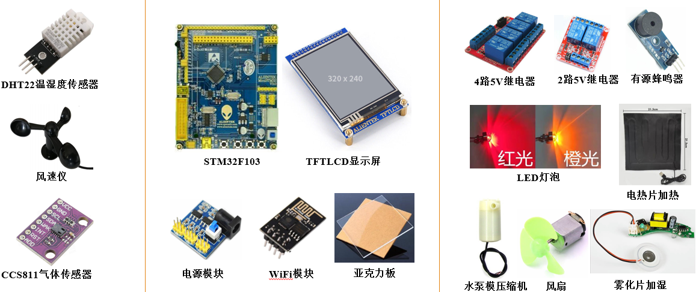

## 快速上手

### 嵌入式部分
按照stm32文件夹内容的程序烧入STM32中，按程序完成硬件连接
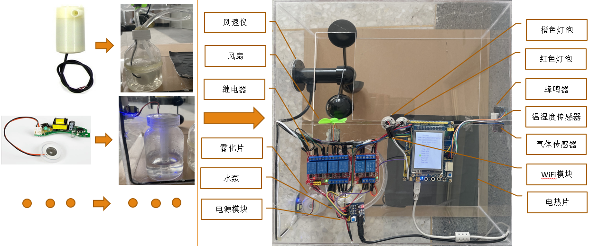

### 上位机部分
1. 环境安装
> `pip install -r requirements.txt`

2. MySQL数据库初始化
> CREATE DATABASE django_freezer_db;
> python manage.py makemigrations
> python manage.py migrate

将创建5张表UserTable用户信息表、FruitEnvironmentTable果品环境数据表、ControlSignalTable控制信号表、FruitControlType当前监测与控制果品数据表、SensorDataTable传感器数据表。

3. 启动上位机
启动上位机，在python目录下
`python main.py`
4. 启动Django服务
python/Django/freezer目录下执行启动Django前后端服务
`python manage.py runserver`

### BIM部分
将你的建筑模型导出为.ifc格式，在导入[知屋安砖](https://platform.zhuanspace.com/)平台完成解析。将refri.html中的开发秘钥和key替换成你的知屋安砖平台开发秘钥和key。

## 技术架构与实现
本设计实现冷藏库多个传感器实时采集冷库环境信息，无线上传到Python上位机，上位机实现数据入库、故障预测、自动控制，在网页上实时更新当前冷库环境数据和报警情况，查看冷库数据的历史记录和故障历史记录，在网页上的BIM模型内进行冷库设备运行情况仿真。本设计主要有下位机、上位机、基于BIM的可视化管理平台三大部分组成。
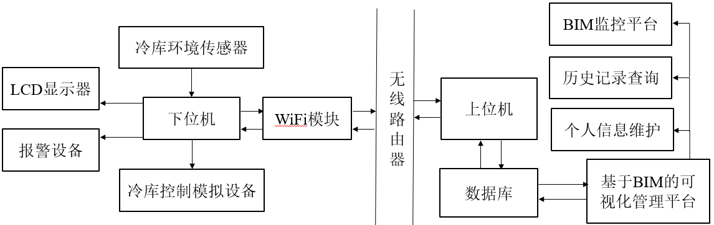
### 嵌入式
下位机用STM32F103采集冷库中的环境信息包括温度、湿度、风速、CO2浓度、TVOC浓度，使用DHT22模块采集温湿度、CCS811模块采集CO2和TVOC浓度、风速仪采集风速，实时显示在TFTLCD显示屏上，使用WiFi模块ESP8266通过TCP通信协议发送到上位机端[22]。上位机处理后返回控制信号和故障信息到下位机上，下位机完成校检与解析成具体控制信号和故障信息，判断出蜂鸣器和灯光报警、压缩机模拟设备、加湿模拟设备、风机模拟设备、热氨融霜模拟设备是否需要工作，若有故障信息，则现实在TFTLCD显示器上。模拟设备需要5V供电，使用电源模块将12V直流电源转换成5V给模拟设备供电，单片机使用USB电源单独供电。
整体流程图
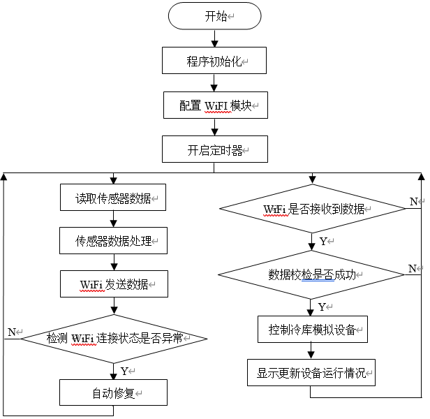

#### LCD显示内容说明
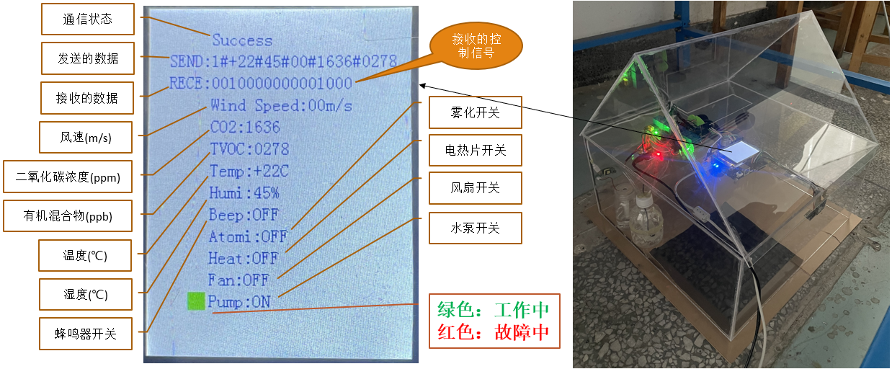
#### 通讯协议设计
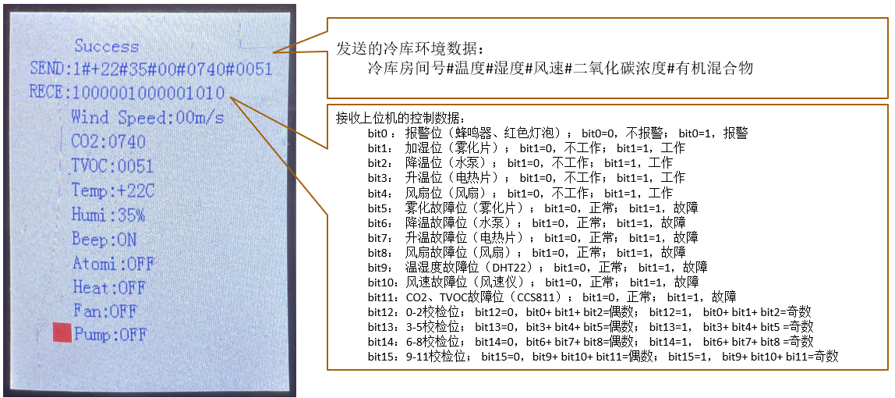

### 上位机
上位机使用Python调用Scoket搭建的TCP服务器解析WiFi模块传来的实时数据，判断数据符合接收要求后完成数据入库操作，在数据库读取当前冷库的水果类型和控制类型，水果环境类型表中记录有当前水果的环境数据的正常范围（如苹果的温度存储范围为0-1度，湿度范围为85-90%等传感器数据范围值），控制类型分为自动和手动。自动控制则根据水果环境类型表的范围判断出下位机模拟设备的运行情况，同时根据传感器数据判断出下位机的故障情况，将自动控制数据储存到数据库并发送到下位机。手动控制则到控制数据表中取出手动控制数据发送至下位机（手动控制信号由基于BIM的可视化管理平台上用户操作生成）。
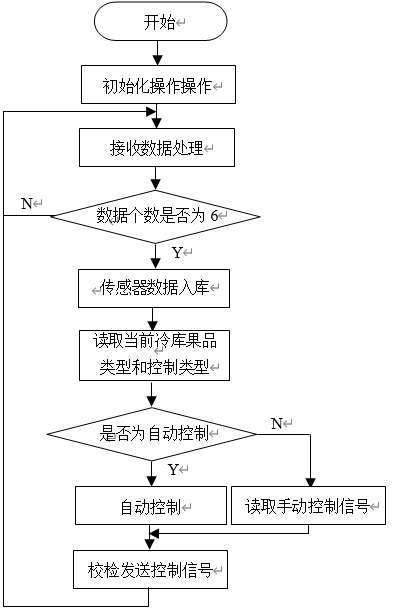

### 基于BIM的可视化管理平台
基于BIM的可视化管理平台使用Django框架搭建，实现用户的登录注册，添加冷藏库水果信息、实时显示冷库环境数据，绘制环境数据变化折线图，对冷库设备进行自动控制和手动按钮控制，冷库BIM模型对冷藏库设备运行报警情况进行仿真。查询冷库环境和冷库设备运行情况历史记录和对用户个人信息修改。BIM模式采用[知屋安砖](https://platform.zhuanspace.com/)API，底层使用ThreeJS实现。
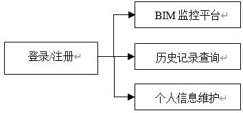

## 效果展示

### 实物展示
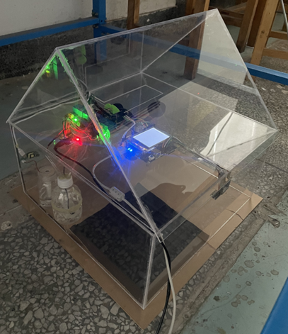

### 登录页
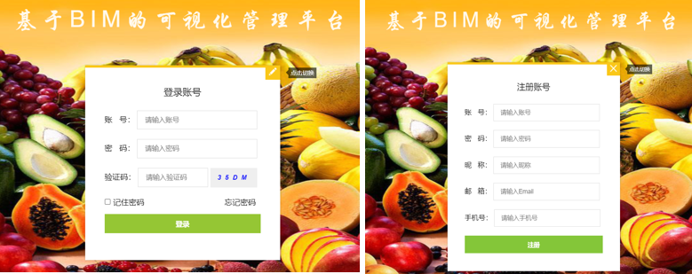

### BIM检测控制平台
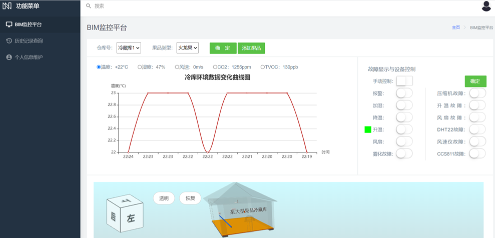

### 查询页
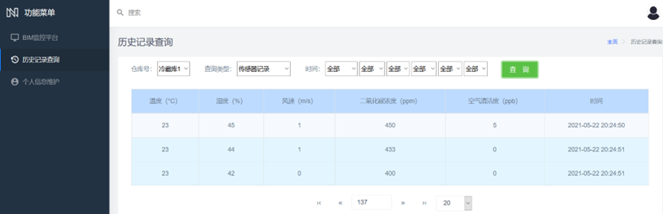

### 个人信息维护页
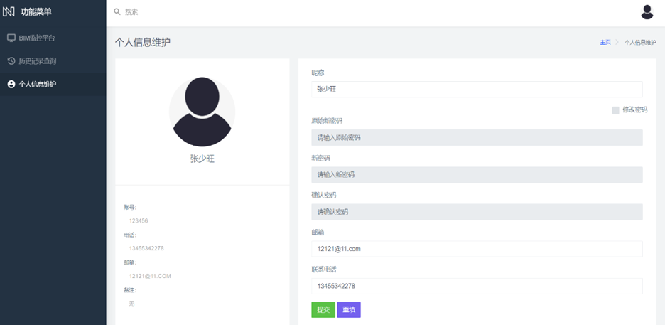

## 待办
- [ ] 上位机集成到Django后端；

## 贡献
欢迎PRs！如果你想为这个项目做贡献，你可以提交pr或issue，[待办](#待办)中有一些可以扩展的功能。我很高兴看到更多的人参与改进并优化它。